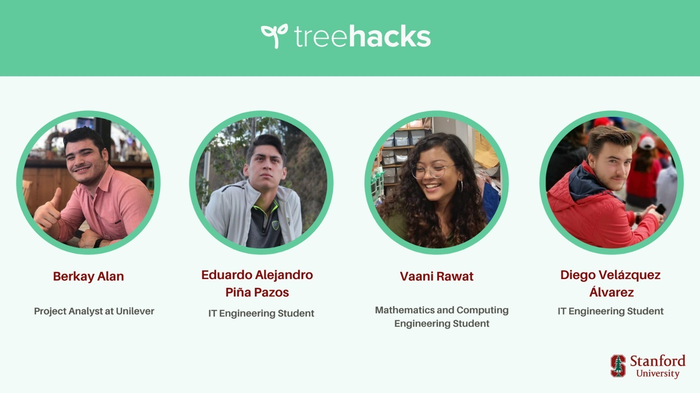

# Treehacks 2021 : Reform the Norm

## Stanford University Treehacks 2021

TreeHacks 2021 will be the 7th-ever iteration of TreeHacks. The theme this year is hacking for the future: addressing deeply impactful problems and building creative, unique solutions. It's identified five global and technological challenges that we think have tons of potential for innovation. Across each of these challenges, we’ve scaffolded resources like potential project ideas, data sets, APIs and toolkits, and more to help get you get started. 

## Our Main Idea

Today, we live in times of rapid social change while also having unparalleled access to information and its subsequent dissemination. However modern political interaction is characterized by strong partisanship and a general lack of interest in information sharing and agreement across party lines.

## Problems

**1) Data breach by social media giants leading to censorship and suppression of voices**

**2) Trauma survivors have difficulty navigating through triggering information**

**3) Creation of Echo-Chambers**

**4) No tangible Impact**

## Inspiration

We're living in times with unparalleled access to information and its subsequent dissemination, hence vastly increasing the potential for rapid social change.

However, modern political interaction is characterized by a general lack of interest in information sharing across varying viewpoints as well as the indulgence in performative allyship leading to no tangible impact. Additionally, social media is wildly notorious for its unethical use of data and algorithms to censor or suppress certain voices while promoting content which they can profit off of. Activism in countries witnessing a rise in polarised governments has also been met with strict action being taken against the ones who dare question the status quo.

With Reform the Norm we advocate to break the norm and then reform it, one step at a time and we do so by incentivizing civic engagement on our decentralized open-for-all platform.

## What it does

Reform the Norm, built on the Ethereum Blockchain provides a decentralized platform for our users to Educate, Listen, Share and Act; covering social movements across issues and across countries.

1) Decentralizing the network gives people back their power by ensuring that there is no censorship or partiality towards a certain kind of content and the user information remains safe from any kind of breach.

2) We provide incentives to our users who actively raise their voices and contribute to the betterment of society by rewarding them with RTN tokens (ERC-20). Protocol followed ~

- 100 RTNs awarded to the user on registering
- 5 RTNs awarded to the user for creating a post and 1 additional RTN awarded per issue tackled in the post
- Users can "tip" other users' posts and the creator of the post would be awarded 2 RTN per tip
- Users can "share" other users' posts and both the creator and the sharer would be awarded 1 RTN each

3) Users are given the provision of adding trigger warning tags for posts that have a high number of trigger words. We do so to forewarn other users who might have Post Traumatic Stress Disorder or other anxiety disorders and would prefer to avoid specific content that might trigger intense physiological and psychological symptoms.

4) Lastly users can specify which issues their post tackles and exactly where in the world is it affecting people. We sort information by "Specific Issues" and "Places" and provide links to our users that would allow them to learn more about the topic, play their part, and donate so that tangible impact occurs along with just social awareness and change.

## How we built it

We started off with designing the prototype with Figma, then built the front-end with HTML, CSS & Javascript. The RTN tokens were made using the ERC-20 standard in solidity. The decentralized back-end was built into the Ethereum Blockchain with Solidity smart contracts, image hosting in IPFS, and local development and testing with Truffle and Ganache. We used the Alchemy API for deploying to the Ropsten TestNet and transaction debugging, and Web3 for integrating our solidity smart contracts with the front-end. We used Python for the trigger warnings side and also implemented it in Javascript.

## Challenges we ran into

We had difficulty using the Alchemy API to integrate our smart contracts with our front-end since the documentation was a bit hard to understand.

## Accomplishments that we're proud of

Formulating a proof-of-concept for something like Reform the Norm that has the potential to bring about rapid, tangible change in society
Learning an entirely new technology, blockchain and figuring out a tech stack including new languages, frameworks and APIs for our project
Collaborating while working on three wildly different timezones and having wildly different backgrounds

## What we learned

We learnt the intricacies of the web 3.0 space and how the future needs to be decentralised in order for the world wide web to be an all-inclusive ethical space like it was initially meant to be. We also learnt about the Ethereum blockchain and the IPFS which when combined give us a fully decentralised web application. All of us wrote code in Solidity which is the language used to write Ethereum smart contracts for the very first time and read up about different kinds of standard tokens like the ERC-20 and ERC-721 and made our own cryptocurrency on the Ropsten TestNet!

## What's next for Reform The Norm

We intend to work a little more on:

- Optimising reach across varying viewpoints by applying graph algorithms on Ethereum nodes
- Integrating NLP into our smart contract to tag trigger words and issues correctly from the server-side
- Coming up with a more effective protocol for incentive provision
And finally, if all goes well we might release a whitepaper for an ICO (initial coin offering) for our cryptocurrency RTN and deploy our smart contract on the Ethereum MainNet.

## Ethics

We at Reform the Norm believe that the world's current socio-political crisis calls for each one of us to actively raise our voice and collectively advocate for social justice. Various countries have witnessed huge political movements gaining traction via social media as the voices of the marginalized, which have historically been violently suppressed are finally attaining their well-deserved level platform.

1) However, activism in the digital age even though raises rapid awareness and pressurizes the ones in power to take quick action, doesn't come without its downsides. There have been several instances wherein social media has been misused by polarised governments for all sorts of unethical actions from inciting riots to online surveillance of citizens. It has also been noted how certain governments have targetted, falsely charged, and subsequently incarcerated activists from marginalized factions since they're the ones who're the most vulnerable in a socio-political climate against their free-willed existence. Hence, when it comes to raising awareness about the wrongs being done by the people in power we need to make sure that people and their personal information is kept safe.

The internet today is broken by design. We see wealth, power, and influence placed in the hands of a limited few tech giants. Markets, institutions, and trust relationships have been transposed to this new platform, with the density, power, and incumbents changed, but with the same old dynamics. Centralization is not socially tenable long-term. Enter Web 3.0.

Web 3.0 is an inclusive set of protocols to provide building blocks for application makers. These building blocks take the place of traditional web technologies but present a whole new way of creating applications. Decentralized applications or DApps have their backend code (smart contracts) running on a decentralized network and not a centralized server. A smart contract is like a set of rules that live on-chain for all to see and run exactly according to those rules. Once DApps are deployed on the Ethereum network you can't change them. DApps can be decentralized because they are controlled by the logic written into the contract, not an individual or a company.

Acknowledging how the future needs to be decentralized in order for the world wide web to be an all-inclusive ethical space like it was initially meant to be, we decided to make our web-application promoting civic engagement decentralized by building it on the Ethereum blockchain. Doing so ensures that our user's data is kept safe from any kind of breach and it also makes sure that the algorithms behind the working of our DApp are transparent and fair.

2) Even though decentralizing our application ensures that the server-side is completely ethical and censorship-resistant we still might have a couple of problems when it comes to sharing information about social causes, them being -

a. Information regarding systemic and systematic oppression might trigger users with PTSD and other anxiety disorders

We have hence given creators of the content the provision to add trigger warning tags so that we can mark content that contains triggering information.

Future ~ We further intend to work on this part by including NLP algorithms into our smart contracts which would automatically generate trigger warning tags.

b. Spreading of Misinformation

Since our platform would be open-for-all for it to be truly democratic there is a risk of people spreading misinformation which could lead to mass panic or further polarization of opinions.

Future ~ We intend to counter this by integrating the Fake News Detection API into our smart contract and generating a warning for other users if the information shared is false.

c. Privileged users co-opting the struggles of the marginalized

With every movement, there comes a wave of performative allyship wherein the privileged take away the voices of the marginalized and co-opt their entire struggle.

Future ~ Taking in more user information (race, religion, ethnicity, sexuality, gender identity, disability, caste, class, etc.) and giving a higher platform to the marginalized factions directly being affected by the issue being talked about.

## Let us introduce our amazing team: Reform the Norm

**Connect with us in Linkedin**

- [Vaani Rawat](https://www.linkedin.com/in/vaani-rawat-3076901a1/)
- [Diego Velázquez Álvarez](https://www.linkedin.com/in/diego-vel%C3%A1zquez-%C3%A1lvarez-184679152/)
- [Eduardo Piña](https://www.linkedin.com/in/eduardo-pi%C3%B1a-5a059117a/)
- [Berkay Alan](https://www.linkedin.com/in/berkayalan/)

### Visit our project in Devpost: https://devpost.com/software/reform-the-norm
